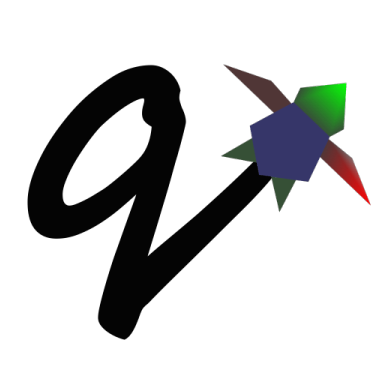

# This is README for QLogo.

## IMPORTANT!!!

QLogo is in a state of transition. This version barely works!

If you want a fully working version of QLogo source you need to checkout
Version 0.92! You can get this either by issuing the following command in your
local QLogo repository:

```
$ git checkout v0.92
```

OR, you can download QLogo Version 0.92 source on QLogo's download page:

https://www.qlogo.org/download/


***


QLogo is free software: you can redistribute it and/or modify
it under the terms of the GNU General Public License as published by
the Free Software Foundation, either version 3 of the License, or
(at your option) any later version.

QLogo is distributed in the hope that it will be useful,
but WITHOUT ANY WARRANTY; without even the implied warranty of
MERCHANTABILITY or FITNESS FOR A PARTICULAR PURPOSE.  See the
GNU General Public License for more details.

You should have received a copy of the GNU General Public License
along with QLogo.  If not, see http://www.gnu.org/licenses/.


***



QLogo is an interpreter for the Logo language written in C++ using
Qt and OpenGL. It mimics (as much as I find reasonable) the UCBLogo
interpreter developed by Brian Harvey at U.C. Berkeley.

You can find the UCBLogo Manual here:

http://people.eecs.berkeley.edu/~bh/usermanual

The differences between QLogo and UCBLogo are described in the
**nuances** section below.

***


## Compiling

QLogo requires Qt6 and is currently being developed and tested on the following
platforms:

* Windows 10 using MinGW 8.1.0 
* OpenSUSE LEAP 15.2 using gcc 7.5.0
* Mac OS X 11.3 using Clang 12.0.5

### To build:

```
$ cmake CMakeLists.txt

$ make
```

This will give you two executables:

1. "logo": this is the Logo interpreter that can be run from the command line.

2. "QLogo": this is the graphical user interface that runs logo and gives you
the turtle. (The turtle is one of the many things that's broken right now, but
when it works again this is where you'll find it.)

There is no "make install" step yet.

***


## There are a few nuances:


* Colors can be specified in one of three ways:

   * as a palette index (0 to 100), same as UCBLogo

   * as a list of 3 percentages, one for each of red, green, blue `[0 0 0]` is
   black, `[100 100 100]` is white

   * as a named color from the X Color Database, e.g. `white` or `lemonchiffon`.
   The X Color database can be found here:
   https://en.wikipedia.org/wiki/X11_color_names


* Changes in font properties (size, color, family) do not affect characters
  already printed. This enables multiple colors and fonts on the same console,
  but it disables any flash or strobe effect.
  


* The entire Logo standard library is loaded internally and buried. There is
  no library directory at this time.


* QLogo does not look for nor automatically load `STARTUP.LG`.


* If `ERRACT` is set and its size is greater than zero, then any errors execute
  `PAUSE`. This was necessary because I couldn't find a reliable way to prevent
  infinite loops during error handling.
  

* Garbage collection is on-the-fly, meaning that memory is freed the moment a
  word/list/array is no longer needed. `GC` and `.SETSEGMENTSIZE` are no-ops.


* No scunching. UCBLogo provided a scrunch to compensate for older CRT screens
  with non-square pixels. This enabled turtle operations to maintain consistent
  physical height-width. `SCRUNCH` and `SETSCRUNCH` are no-ops.


* `SAVEPICT` saves a copy of the canvas in the format given by the filename's
  extension. For example: `SAVEPICT "MY_PICTURE.PNG` will save in PNG
  format. QLogo can save an image in the following formats: BMP, JPG/JPEG,
  PNG, PPM, XBM, and XPM


* `HELP` is functional, but the text is a copy of the UCBLogo help text. As
  such, it should be 99.9% correct. This will be fixed.


* There is no facility yet for translation/internationalization. Yet.


### The following commands are not implemented:

`SETMARGINS`:

The original purpose of the command was to enable text to
be visible on projectors which cut off outer boundaries of
a computer screen. Projectors and monitors produced in the
last few years show all of the computer screen. On top of
that QLogo is a windowed application so an instructor or
presentor can move the window to a different position.


`FILL`:

Two reasons: One of the user interface principles was that
the canvas should be device resolution-independent. That
means when the QLogo window is resized or the separator
between the text and the graphics is moved the graphics
will remain consistent. The Flood Fill algorithm depends on
specific pixels which means that the display can change
dramatically depending on the size of the canvas. The other
reason is that the Flood Fill algorithm can slow down
window resizing. Use FILLED instead.

`LOADPICT`:

This will be implemented soon.

`EPSPICT`:

This will be replaced by SVGPICT.

`CSLSLOAD`:

Not implemented yet.

`SETCSLSLOC`:

Not implemented yet.

`SETEDITOR`:

QLogo uses a built-in editor.

`SETLIBLOC`:

The QLogo library is stored internally.

`SETHELPLOC`:

The help text is stored internally by the
application. There is no external file.

`SETTEMPLOC`:

QLogo doesn't create temporary files at this time.


### The following variables have no special meaning:

`COMMANDLINE`:

QLogo is a GUI application at the moment, although a
significant amount of thought is being given to make this
also a command-line program.

`REDEFP`:

Qt has strong support for internationalization, but QLogo
is not designed at this time to take advantage of
that. Internationalization will be supported soon.

`USEALTERNATENAMES`:

Ditto.


### The following commands are NEW:

`ALLFONTS`:

Returns a list of all the fonts available on your system.

`CURSORINSERT`:

Sets cursor to insert mode, this is the default.

`CURSOROVERWRITE`:

Sets cursor to overwrite mode.

`CURSORMODE`:

Outputs either `INSERT` or `OVERWRITE`.

`BOUNDS`:

Outputs a list of two numbers giving the maximum bounds (x,y)
of the canvas.  e.g. bounds of [350 150] means that the
turtle is visible if its X-coordinate is between -350 and 350
and its Y-coordinate is between -150 and 150. The coordinate
[0, 0] is always in the center. See `SETBOUNDS`

`SETBOUNDS`:

Takes two integers and sets outer bounds of the canvas.
See `BOUNDS`.

`MATRIX`:

This exists for debugging and may be removed. Outputs a
list of four lists, each sublist contains four numbers. This
is the matrix that represents the current turtle state. In
row-major order.

